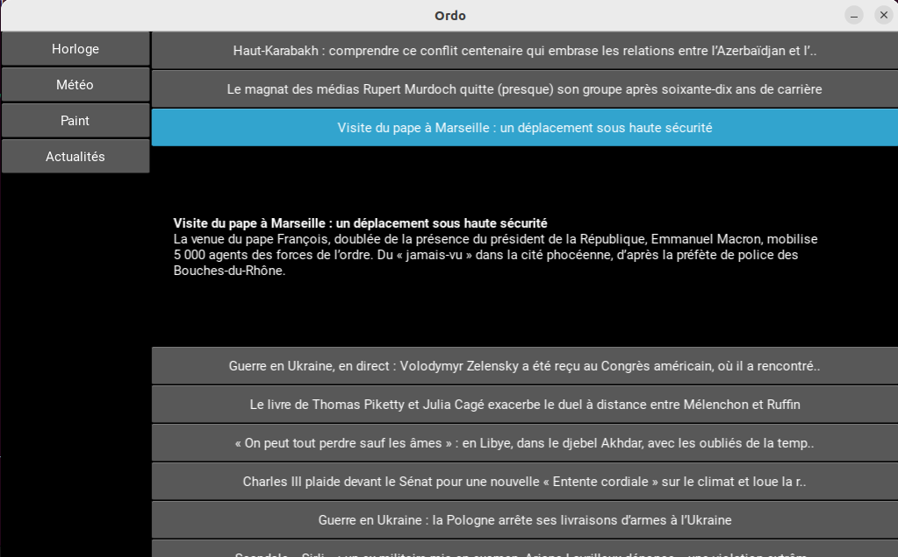

# Ordo_news

Application Ordo permettant d'afficher l'ensemble des actualités venant de flux RSS.

Vous pouvez créer un fichier sous le nom de ordo_news.json dans le dossier parameters de votre application Ordo et y ajouter les flux de votre choix dans un tableau : 

```
{
    "rss_list": ["https://exemple_flux1.xml","https://exemple_flux2.xml"]
}
```



## Ajouter l'application

Sur Ordo, déposer ce dossier dans "plugins" dans votre application Ordo.

Puis, sur parameters/ordo.json, ajouter Ordo_news de cette manière : 

```
{
    "plugins" : ["ordo_news"]
}
```